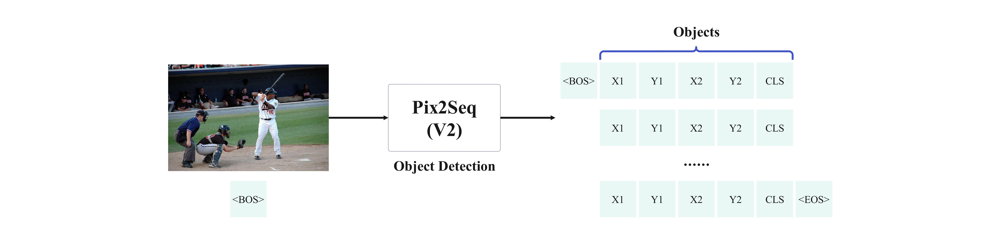
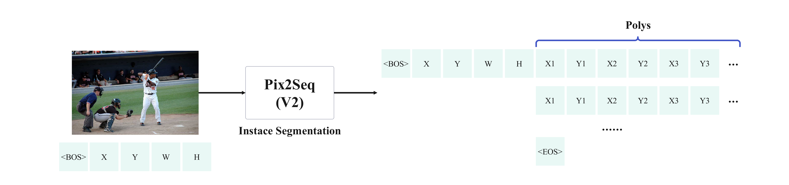
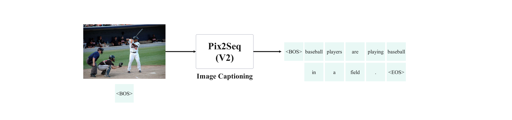
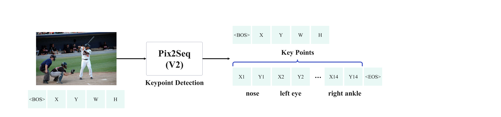

# Pix2SeqV2-Pytorch

Simple PyTorch implementation of Pix2SeqV2. This project references  [moein-shariatnia's Pix2Seq](https://github.com/moein-shariatnia/Pix2Seq) and the paper [A Unified Sequence Interface for Vision Tasks](http://arxiv.org/abs/2206.07669). 

<div align=center>


</div>

## Introduction

Pix2Seq is a generalized framework for solving visual tasks proposed by Google. Essentially it **treats visual tasks as language tasks**, generating sequences of tokens by auto-regression, and obtaining the output of many visual tasks(e.g., object detection, segmentation, captioning, keypoint, etc.) by decoding the tokens.

The official implementation of Pix2Seq [google-research/pix2seq: Pix2Seq codebase](https://github.com/google-research/pix2seq) is written in TensorFlow. **I wish there was a PyTorch implementation.** Then [Shariatnia](https://github.com/moein-shariatnia/Pix2Seq) gave me a simple implementation of Pix2SeqV1(just for object detection, no multi-task training). I followed his project and added something new below:

- For objection detection, add support for **COCO2017 datasets**.
- Keep the network structure unchanged and add interfaces for **more tasks(instance segmentation, image captioning and keypoint detection)**.
- Add support for **multi-task training**. 

Something notes:

- This project is just a simple implementation in PyTorch, I only referred to [the original paper](http://arxiv.org/abs/2206.07669) for other tasks' interface, please **refer to [the official implementation](https://github.com/google-research/pix2seq) for more details**.
- Since this is **a practice project**, I only used **one GPU of RTX 3090ti** for training and reasoning. The main purpose of this project is to **verify the feasibility of multi-task training**, so I don't have more performance requirements.
- If you want to improve the performance, just try to **1)add more data augmentations, 2)train for more epochs and 3)replace the model with a larger number of params**, etc.

If you have more questions about this project, feel free to issues and PRs!

## Environment

I use anaconda to manage my python environment. You can clone my environment by doing this:

```sh
# change to root dir
cd Pix2SeqV2
# create a new python 3.8 env
conda create -n your_env_name python=3.8
# install essential packages
pip install -r ./requirements.txt
```

If you want to run the project, **you need to have at least one GPU with more than 12G memory**. Of course, the more GPUs the better! 

> I haven't written the code for **multi-GPU training**, but it's **coming soon**.

## Configurations

All configurations can be modified in CFG class in Pix2SeqV2/config.py. Most of my training configurations come from Shariatnia's tutorials. 

I use relative paths for other configs like weights and other required files. **The only thing you need to change is the path of the dataset**.

> To fetch VOC dataset, just `cd download` and `bash download_voc.sh`
>
> To fetch COCO2017 dataset, download [here](https://cocodataset.org/)

```python
# For VOC dataset, you need to change the following two var
img_path = '../download/VOCdevkit/VOC2012/JPEGImages'
xml_path = '../download/VOCdevkit/VOC2012/Annotations'
# For COCO dataset, you need to change dir_root
dir_root = '/mnt/MSCOCO'
```

**I trained some weights for different tasks, you can fetch them [here](https://pan.baidu.com/s/1NKrsdx-Qsh0qJ-qhJY694A?pwd=1212)**. Put them in folder Pix2SeqV2/weights, so that you don't need to change corresponding configs.

## A Small Demo

Before diving into the formal Train&Infer session, let me show a small demo for the multi-task processing.

**I just trained the multi-task model weight for 2 epochs in 11 hours**, including four tasks(instance segmentation, object detection, image captioning and keypoint detection). So the results are unsurprisingly poor, forgive me =v=. The weight can be download [here](https://pan.baidu.com/s/1NKrsdx-Qsh0qJ-qhJY694A?pwd=1212).

I random choose a picture(No.6471) from COCO validation dataset for visualization.

<div align=center>


</div>

Next, you can run the following code to get the results of the four tasks.

```sh
# mask sure you're in the root directory and set the right weight path(multi_task_weight_path) in CFG 
cd infer
python infer_single_image_multi_task.py --image ../images/baseball.jpg > result.txt
```

After that you can see three images(`instance_segmentation.png, keypoint_detection.png, object_detection.png`) and a txt file(`result.txt`) in the infer directory. 

result.txt shows all the predictions, 

```
skipping pos_embed...
skipping pos_embed...
<All keys matched successfully>
Captioning:
[['baseball', 'player', 'swinging', 'his', 'bat', 'at', 'home', 'plate', '.']]
[['batter', 'during', 'the', 'game', 'of', 'baseball', 'game', '.']]
[['baseball', 'players', 'are', 'playing', 'baseball', 'in', 'a', 'field', '.']]
Bounding boxes:
[[ 15.665796 134.68234  130.5483   191.906   ]
 [262.4021    69.40819   90.07831  232.37599 ]
 [  0.        94.21238   15.665796  53.524773]
 [ 96.60574   78.54657   44.38643   61.357697]
 [206.26633  223.45518   28.720627  37.859024]
 [259.79114   72.01914   75.71802  229.76505 ]
 [ 97.911224 180.37425  137.07573  140.99214 ]
 [  0.        95.51784   19.582247  53.52481 ]]
Labels:
['person', 'person', 'person', 'person', 'baseball glove', 'person', 'person', 'person']
Keypoint list:
[[0, 0, 0, 0, 0, 0, 0, 0, 0, 0, 176, 125, 198, 117, 168, 145, 237, 157, 0, 0, 261, 167, 180, 184, 205, 183, 173, 208, 204, 210, 0, 0, 0, 0], [0, 0, 0, 0, 0, 0, 0, 0, 0, 0, 0, 0, 0, 0, 0, 0, 0, 0, 0, 0, 0, 0, 0, 0, 0, 0, 0, 0, 0, 0, 0, 0, 0, 0], [0, 0, 0, 0, 0, 0, 0, 0, 0, 0, 0, 0, 0, 0, 0, 0, 0, 0, 0, 0, 0, 0, 0, 0, 0, 0, 0, 0, 0, 0, 0, 0, 0, 0], [0, 0, 0, 0, 0, 0, 0, 0, 0, 0, 0, 0, 0, 0, 0, 0, 0, 0, 0, 0, 0, 0, 0, 0, 0, 0, 0, 0, 0, 0, 0, 0, 0, 0], [0, 0, 0, 0, 0, 0, 0, 0, 0, 0, 0, 0, 0, 0, 0, 0, 0, 0, 0, 0, 0, 0, 0, 0, 0, 0, 0, 0, 0, 0, 0, 0, 0, 0], [0, 0, 0, 0, 0, 0, 0, 0, 0, 0, 0, 0, 0, 0, 0, 0, 0, 0, 0, 0, 0, 0, 0, 0, 0, 0, 0, 0, 0, 0, 0, 0, 0, 0], [0, 0, 0, 0, 0, 0, 0, 0, 0, 0, 0, 0, 0, 0, 0, 0, 0, 0, 0, 0, 0, 0, 0, 0, 0, 0, 0, 0, 0, 0, 0, 0, 0, 0]]
```

Three images visualize the results of the different visual tasks. 

<div align=center>


</div>

The **low recall of object detection task**  may be due to **poor data augmentation and not enough training epochs**.  

The **segmentation task performed OK** given the object detection box, as it was given the maximum training weight and I followed the settings of the original paper: **repeat the prediction eight times to ensure recall**.

The **keypoint detection task performed very poorly**, I think there are a few reasons for this: firstly it has **the lowest weight** in the multi-task training; secondly **the bounding box I used in data augmentation seems to be too big** (twice as big of a detection box, following the original paper's setup), resulting more than one person in the bbox.

Anyway, JJJymmm's pix2seqV2 has taken the first step !!!

## Training & Inference

### Object Detection



For object detection, you can run the following code to train Pix2Seq from scratch. Hyperparameters such as training epochs, learning rate, etc. can be set in `./config.py`. And the weights are saved in the directory `./train`.

```sh
# mask sure you're in the root directory
cd train
python train_coco_object_detection.py # train on COCO2017
python train_voc_object_detection.py # train on VOC
```

Once the weights are obtained,  you can run the code to infer a single image.

```sh
# mask sure you're in the root directory
cd infer
python infer_single_image_object_detection.py --image your_image_path # COCO2017
python infer_single_image_voc.py --image your_image_path # VOC
```

The predictions(bounding boxes and labels) are printed in terminal and the results of visualization are saved in `object_detection.png`.

Training and prediction for the other tasks did not differ much from this task.

### Instance Segmentation



Code for training.

```sh
# mask sure you're in the root directory
cd train
python train_coco_segmentation.py
```

Code for inference.

```sh
# mask sure you're in the root directory
cd infer
python infer_single_image_segmentation.py --image your_image_path --box selected_area(format:xywh)
```

The results of visualization are saved in `instance_segmentation.png`.

### Image Captioning



Code for training.

```sh
# mask sure you're in the root directory
cd dataset
python build_captioning_vocab.py # generate vocab.pkl
# put the vocab.pkl to train folder or set the vocab_path in CFG
cd ../train
python train_coco_img_captioning.py
```

Code for inference.

```sh
# mask sure you're in the root directory
cd infer
python infer_single_image_caption.py --image
```

The results are printed in terminal.

### Keypoint Detection



Code for training.

```sh
# mask sure you're in the root directory
cd train
python train_coco_segmentation.py
```

Code for inference.

```sh
# mask sure you're in the root directory
cd infer
python infer_single_image_segmentation.py --image your_image_path --box selected_area(format:xywh)
```

The results of visualization are saved in `keypoint_detection.png`.

### Multi-Task

Code for training.

```sh
# mask sure you're in the root directory
cd train
python train_multi_task.py --task task1,task2,task3...
# supported tasks: detection,keypoint,segmentation,captioning
```

Code for inference.

```sh
# mask sure you're in the root directory
cd infer
python infer_single_image_segmentation.py --image your_image_path --box selected_area(format:xywh)
```

The text results are printed in terminal and the results of visualization are saved in `object_detection.png`, `keypoint_detection.png`, `instance_segmentation.png`.

## Some Results

<div align=center>


</div>

## Cite

- [Pix2seq : official implementation(by Tensorflow)](https://github.com/google-research/pix2seq)

- [Pix2seqV1 implementation(by PyTorch)](https://github.com/moein-shariatnia/Pix2Seq)

- [Pix2seq paper](https://arxiv.org/abs/2109.10852):

  ```
  @article{chen2021pix2seq,
    title={Pix2seq: A language modeling framework for object detection},
    author={Chen, Ting and Saxena, Saurabh and Li, Lala and Fleet, David J and Hinton, Geoffrey},
    journal={arXiv preprint arXiv:2109.10852},
    year={2021}
  }
  ```

- [Pix2seq multi-task paper](https://arxiv.org/abs/2206.07669):

  ```
  @article{chen2022unified,
    title={A Unified Sequence Interface for Vision Tasks},
    author={Chen, Ting and Saxena, Saurabh and Li, Lala and Lin, Tsung-Yi and Fleet, David J. and Hinton, Geoffrey},
    journal={arXiv preprint arXiv:2206.07669},
    year={2022}
  }
  ```
## Acknowledgement 
坐上那飞机去拉萨（civi粉丝版）
